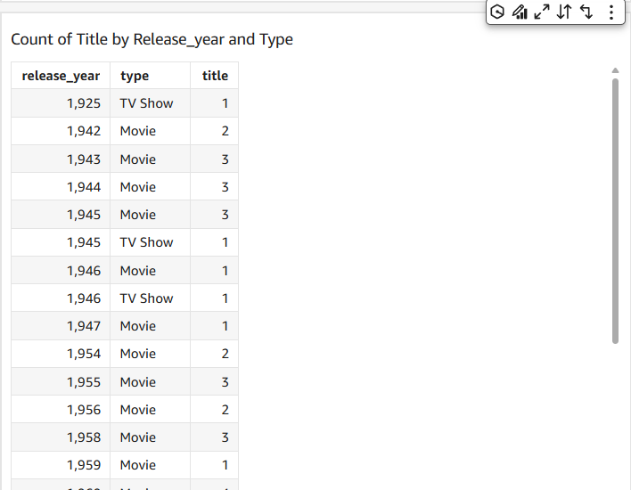
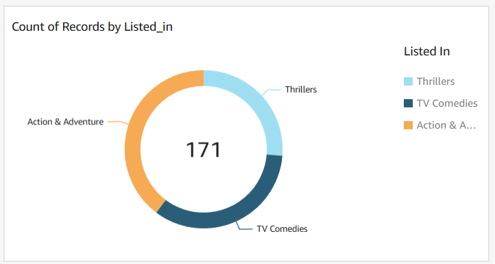

# Data Analysis using AWS QuickSight
The data that I've used is from netflix and can be found here:
[Netflix Titles](netflix_titles.csv)
---

## Visualizations
- To create visualisation on QuickSight, you’ll have to drag the relevant fields into the QuickSight dashboard's AutoGraph Space.

- The chart/graph shown here is a breakdown of `Movies vs TV-shows for every release year`. 
I created this graph by *putting the release year on the Y-axis, and making the type (`i.e. movie or tv show`) the grouping variable*.

- Count of Records by Release_year

- Would it be possible to stack movies and TV shows in the same row, so you can visualise the % of each?

- Now, Show the same thing in a table? i.e. please show me the number of movies vs TV shows per release year if possible.

- On what day did Netflix add the largest number of movies/TV shows to their catalogue?

‍
- Of the TV shows and movies featured, how many were listed as 'Action & Adventure', 'TV Comedies', or 'Thrillers'? For simplicity, ignore the TV shows and movies that have multiple listings/categories. 

- Of the TV shows and movies with the listing 'Action & Adventure', 'TV Comedies', or 'Thrillers', how many were released on 2015 or after?

---